# Mục tiêu

Hệ thống ***Quản lý điểm và cấp bằng*** được xây dựng dành cho các tổ chức giáo dục lớn, mục đích để giúp việc quản lý quá trình học tập của học viên trở nên hiệu quả hơn. Toàn bộ quá trình học, điểm số và thành tích học tập của học viên được ghi lại đầy đủ và chi tiết. Đồng thời, hệ thống cũng giúp kiểm tra những học viên nào, sau quá trình học tập tại tổ chức, đạt đủ tiêu chuẩn để được cấp bằng chứng nhận (hoặc bằng tốt nghiệp).

Hệ thống cũng nhằm mục đích giúp học viên tự quản lý tốt hơn quá trình học tập của mình. Đó là bởi việc đăng ký học cũng như toàn bộ điểm số, học phí của sinh viên/học viên đều có thể được thực hiện hoặc tra cứu trực tiếp trên hệ thống mà không cần liên lạc với tổ chức.

# Công nghệ sử dụng

Công nghệ sử dụng để xây dựng hệ thống này bao gồm:

* Công cụ phân tích và thiết kế hệ thống: Astah UML.
* Ngôn ngữ lập trình: PHP, HTML5, JavaScript.
* Công cụ lập trình: Visual Studio Code 2017, Sublime Text.
* Framework: Laravel, giúp xây dựng hệ thống theo mô hình MVC.

# Hướng dẫn cài đặt

Để cài đặt toàn bộ hệ thống ***Quản lý điểm và cấp bằng*** nói trên, máy tính cần phải có công cụ giả lập web-server và công cụ quản lý các package PHP.

Bước đầu tiên, cần phải giả lập một web-server trên máy tính sử dụng. Hiện nay có rất nhiều phần mềm hỗ trợ điều này, có thể kể đến như Openserver, Wamp, Xampp, Ampps, Vertrigo, ... Tất cả các phần mềm đó đều có thể được sử dụng, trong số đó, Xampp sẽ được chọn làm ví dụ. Việc cài đặt Xampp trên máy tính chỉ đơn giản là việc chạy tập tin cài đặt và làm theo các yêu cầu sau đó. Xampp có thể được cài ở bất cứ vị trí nào trên máy tính, nhưng thông thường sẽ được cài trực tiếp trong ổ C. Sau khi kết thúc, tại vị trí cài đặt sẽ xuất hiện một thư mục `xampp` và trong đó có thư mục con `htdocs`, chính là nơi sẽ chứa toàn bộ dự án. Toàn bộ quá trình cài đặt Xampp được thể hiện chi tiết như sau:

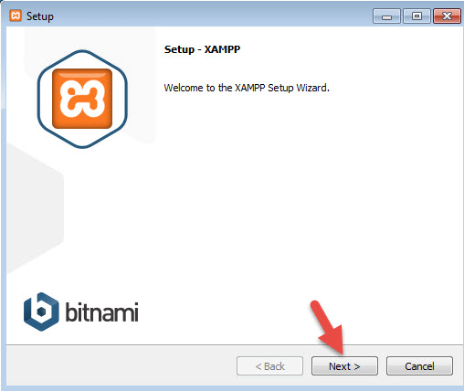

Chạy tập tin cài đặt và chọn Next.

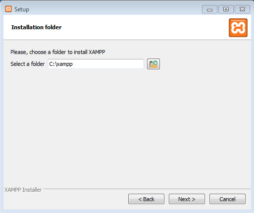

Chọn đường dẫn và nhấn Next.

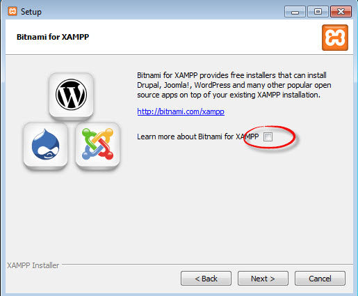

Bỏ chọn tại *Learn more about Bitnami for XAMPP* và tiếp tục nhấn Next; cuối cùng nhắn Finish để kết thúc.

Bước tiếp theo, cần phải cài đặt Composer, một công cụ giúp quản lý các package PHP. Việc cài đặt Composer cũng đơn giản chỉ là chạy tập tin cài đặt. Tuy nhiên, trong quá trình đó, Composer sẽ yêu cầu chọn đường dẫn tới tập tin `php.exe` trên máy tính. Đường dẫn này sẽ là `\xampp\php\php.exe`, trong đó `xampp` là thư mục đã được đề cập ở trên. Sau khi quá trình kết thúc, người dùng có thể sử dụng câu lệnh `composer -v` trong Terminal (CMD hoặc GitBash) để kiểm tra xem quá trình cài đặt Composer có thành công hay không.

Tiếp theo đó, cần xây dựng cơ sở dữ liệu giúp hệ thống hoạt động. Việc này được thực hiện bằng cách vào phpMyadmin (bằng cách khởi động Xampp và sử dụng đường dẫn `localhost/phpmyadmin` trên trình duyệt) và tạo một cơ sở dữ liệu mới, cụ thể như sau:

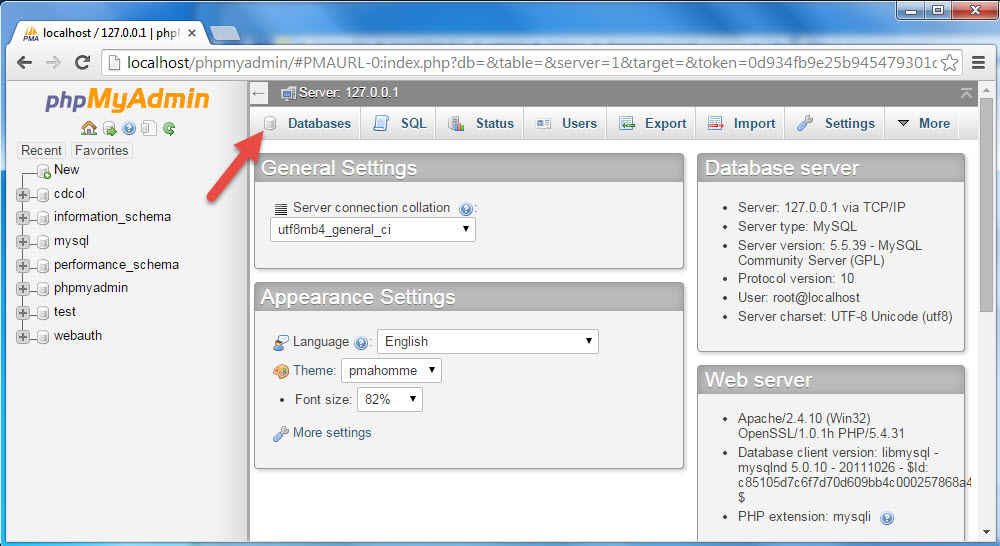

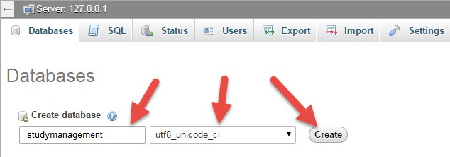

Cơ sở dữ liệu mới tạo sẽ có một số thông tin như sau:

* **Database Host:** localhost.
* **Database user:** mặc định là `root`.
* **Database password:** mặc định là `null` - trống.
* **Database name:** Do người dùng tự đặt.

Bước cuối cùng, đó là chuyển toàn bộ thư mục dự án vào trong thư mục `htdocs` đã được nhắc tới ở trên và cấu hình lại một số chi tiết nhỏ như sau:

* Đổi tên tập tin `.env.example` thành `.env` (nếu tập tin `.env` chưa tồn tại trong thư mục dự án).
* Dùng Terminal (CMD hoặc PowerShell) truy cập vào bên trong thư mục dự án và sử dụng dòng lệnh
> composer global require "laravel/installer"

để cài đặt một số thuộc tính cần thiết.
* Vẫn trên cửa sổ Terminal đó, dùng lệnh
> php artisan key:generate

để sinh ra một key Laravel.
* Trong tập tin `.env`, chỉnh lại thông số `DB_DATABASE`, `DB_USERNAME` và `DB_PASSWORD`, tương ứng là tên cơ sở dữ liệu cần làm việc (đã tạo ở trên), tên người dùng trong phpMyadmin (mặc định là `root`) và mật khẩu người dùng trong phpMyadmin (mặc định là `null`). Thao tác này giúp dự án Laravel có thể tương tác với đúng cơ sở dữ liệu mong muốn trong phpMyadmin.
* Để xây dựng mô hình cho cơ sở dữ liệu (bao gồm 8 bảng như đã trình bày ở phần 4.1), sử dụng lệnh
> php artisan migrate

trong cửa sổ Terminal nói trên.
* Tiếp theo, trên Terminal đó sử dụng lần lượt các lệnh
> php artisan db:seed --class=admins

> php artisan db:seed --class=users

để thêm quản trị viên đầu tiên trong cơ sở dữ liệu. Đó là bởi toàn bộ hệ thống được quản lý bởi các quản trị viên, nếu không có quản trị viên, không thể thêm, sửa, xóa các thành viên khác, khiến hệ thống không thể hoạt động được.

Sau khi thực hiện toàn bộ những thao tác cài đặt nói trên, hệ thống ***Quản lý điểm và cấp bằng*** có thể đưa vào hoạt động một cách bình thường.

# Hướng dẫn sử dụng chi tiết

## Video hướng dẫn sử dụng

Toàn bộ phần hướng dẫn sử dụng dưới đây được trình bày vô cùng chi tiết trong [video này](https://drive.google.com/file/d/1_09NimxwT1iZ5INJozduSEExgp-f-av8/view).

Trong trường hợp video trên gặp vấn đề, có thể xem [tại đây](https://youtu.be/CqX79IRu_fA).

## Mô tả chung

Hệ thống bao gồm 4 tác nhân:
* **Sinh viên:** Bao gồm toàn bộ sinh viên của trường (không bao gồm sinh viên đã tốt nghiệp hoặc bị buộc thôi học).
* **Giảng viên:** Bao gồm toàn bộ các giảng viên của trường (không bao gồm giảng viên đã về hưu hoặc thôi giảng dạy tại trường).
* **Nhà trường:** Tác nhân nhà trường được đại diện bởi các nhân viên quản lý (trong hệ thống được gọi là quản trị viên hay admin). Mỗi nhân viên quản lý (quản trị viên) có một tài khoản riêng, thực hiện những tác vụ trong quyền hạn của mình.
* **Khách thăm:** Bao gồm toàn bộ những ai không thuộc quản lý của hệ thống, nhưng muốn tra cứu và tìm hiểu thông tin về hệ thống (ví dụ: phụ huynh sinh viên).

Chỉ có thành viên của hệ thống (sinh viên, giảng viên, quản trị viên) khi đã có tài khoản mới có thể đăng nhập vào hệ thống. Khách thăm không có quyền tạo tài khoản trên hệ thống. Quản trị viên hệ thống là những người duy nhất được quyền tạo tài khoản cho những cá nhân thuộc quyền quản lý của nhà trường.

## Đối với khách thăm

Khi truy cập vào hệ thống, trang chủ sẽ được hiển thị như hình dưới đây. Các chức năng của hệ thống được đặt ở thanh chức năng phía trên ảnh nền.

Khách thăm không cần đăng nhập vào hệ thống vẫn có thể thực hiện một số tác vụ chung như sau:

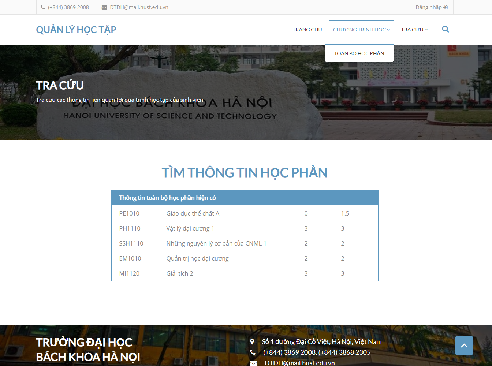

Xem thông tin toàn bộ học phần hiện có của trường

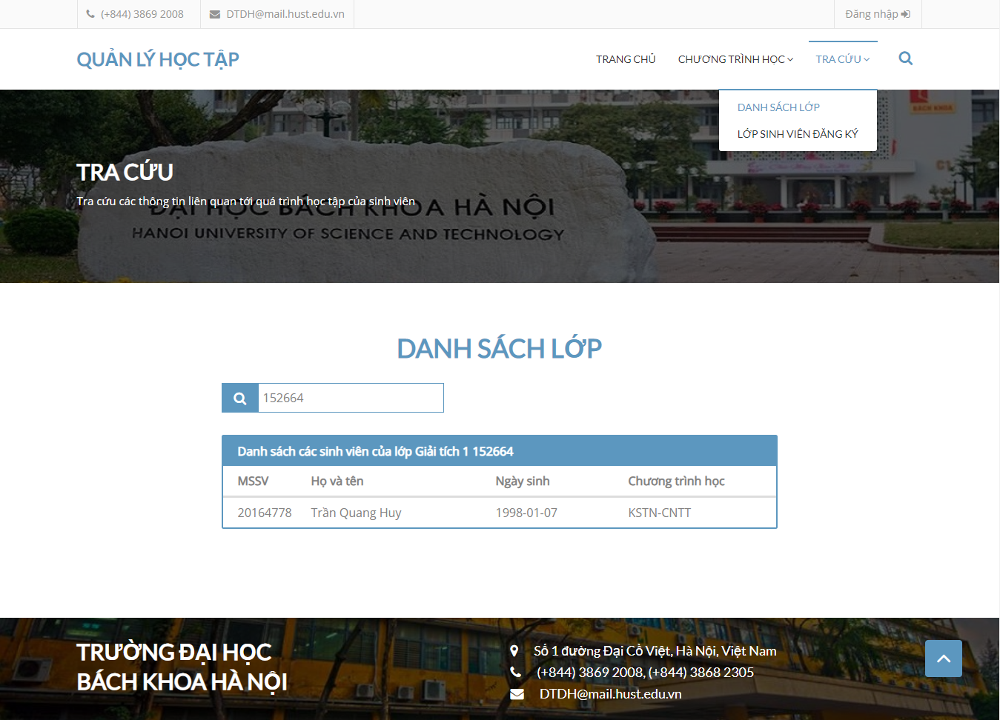

Tra cứu danh sách các sinh viên đăng ký một lớp

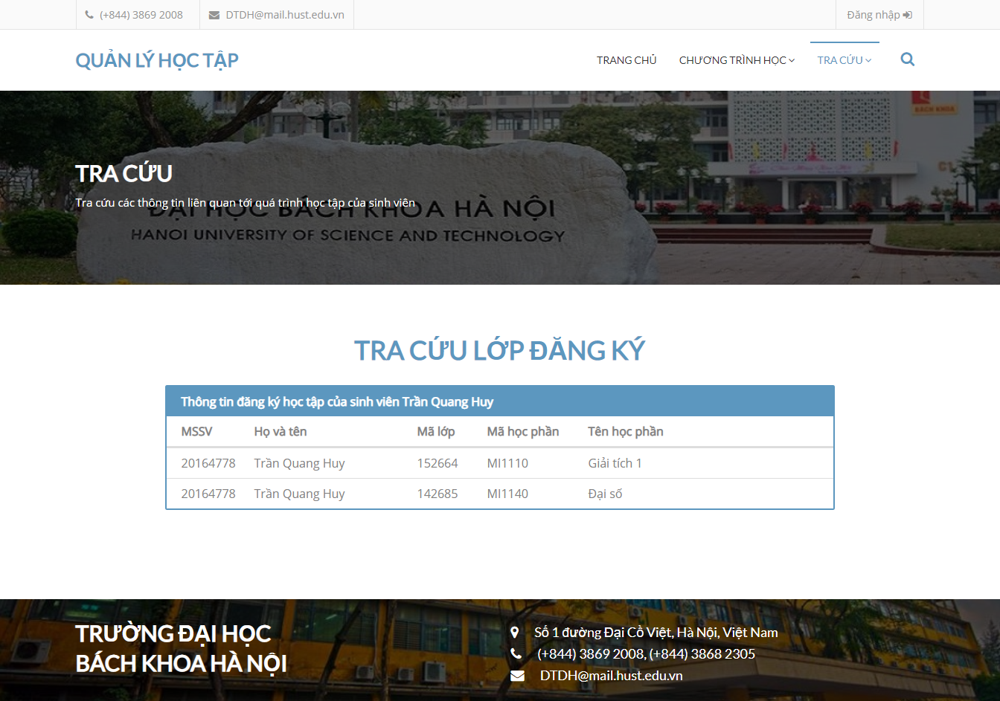

Tìm danh sách các lớp mà sinh viên đăng ký

## Đối với sinh viên

Sinh viên cần đăng nhập vào hệ thống để thực hiện các chức năng liên quan tới quá trình học tập của mình. Sau khi đăng nhập, số điện thoại và địa chỉ email của sinh viên (nếu đã được cập nhật) đó sẽ được hiển thị góc trên bên trái cửa sổ. Một số tác vụ dành cho sinh viên được mô tả như sau:

**Các tác vụ chung:** Sinh viên có quyền thực hiện mọi tác vụ chung mà khách thăm có thể thực hiện.

**Xem và cập nhật thông tin cá nhân:** Toàn bộ thông tin cá nhân của sinh viên được hiển thị, trong đó có một số thông tin có thể cập nhật được bằng cách điền vào vị trí tương ứng trong bảng và nhấn *Cập nhật thông tin* để xác nhận. Các thông tin khác nếu muốn cập nhật, phải thông báo với quản trị viên, quản trị viên sẽ thực hiện. Chức năng xem thông tin này cũng có thể được thực hiện ngay khi click vào tên của chính sinh viên đó (bên cạnh nút *Đăng xuất*).

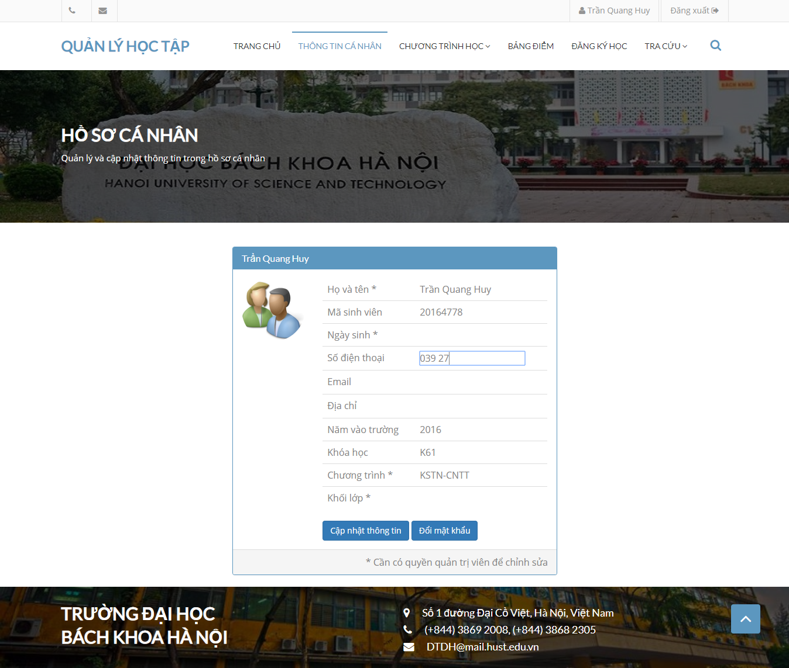

Bên cạnh đó, sinh viên có thể đổi mật khẩu tài khoản của mình bằng cách nhấn vào *Đổi mật khẩu*.

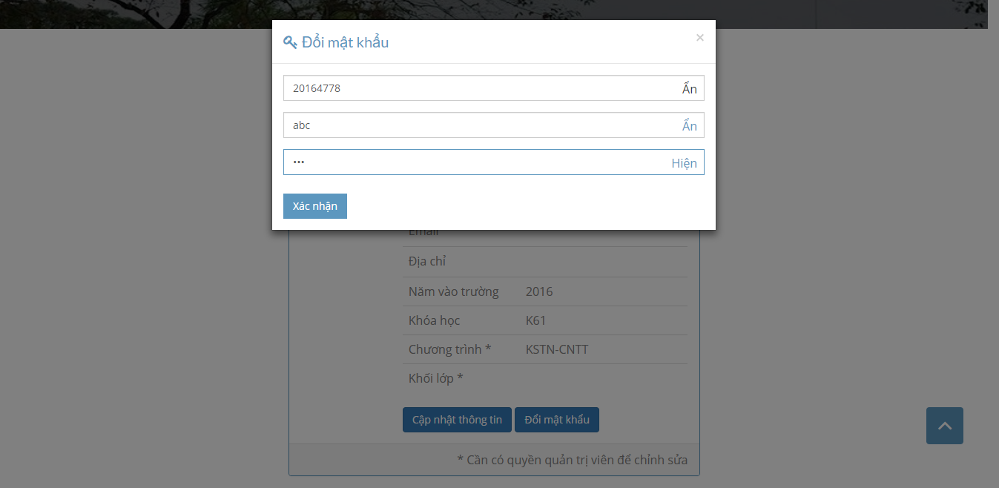

Khi click vào *Đổi mật khẩu* phía cuối hồ sơ cá nhân, một cửa sổ pop-up sẽ hiện ra để sinh viên nhập vào. Sinh viên điền mật khẩu cũ, đồng thời tạo và xác nhận mật khẩu mới. Nếu thành công (mật khẩu cũ ghi đúng, mật khẩu mới tạo và xác nhận trùng khớp), hệ thống sẽ thay đổi mật khẩu của tài khoản.

**Xem lộ trình học:** Khi click vào mục *Lộ trình học* trong menu *Chương trình học* trên thanh chức năng, thông tin chi tiết về những học phần sinh viên này cần học và điểm số của từng học phần đó (nếu có) sẽ được hiển thị.

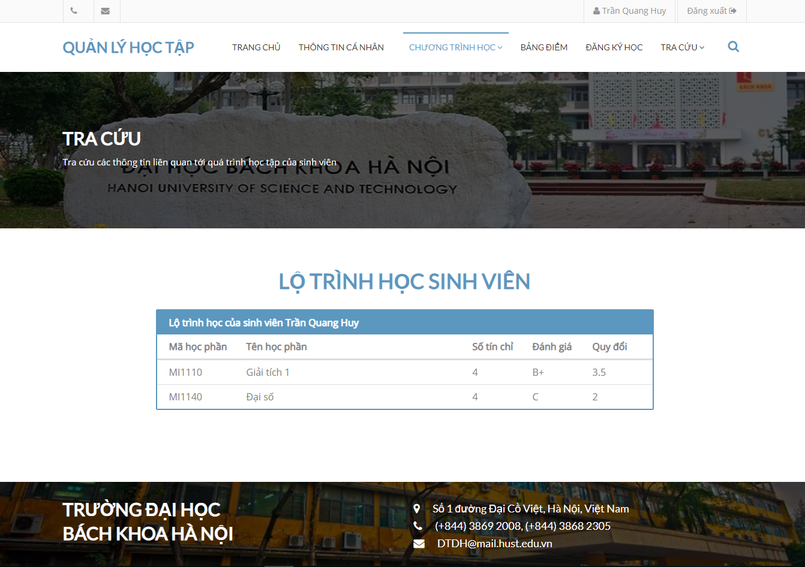

**Xem bảng điểm cá nhân:** Khi click vào mục *Bảng điểm SV* trên thanh chức năng, thông tin chi tiết về bảng điểm cá nhân của chính sinh viên đó sẽ được hiển thị. Còn với quản trị viên, khi click vào *Bảng điểm SV* như vậy, cần điền thêm mã số sinh viên cần tìm vào khung tìm kiếm, nhấn biểu tượng tìm kiếm sẽ thu được kết quả về bảng điểm của sinh viên đó.

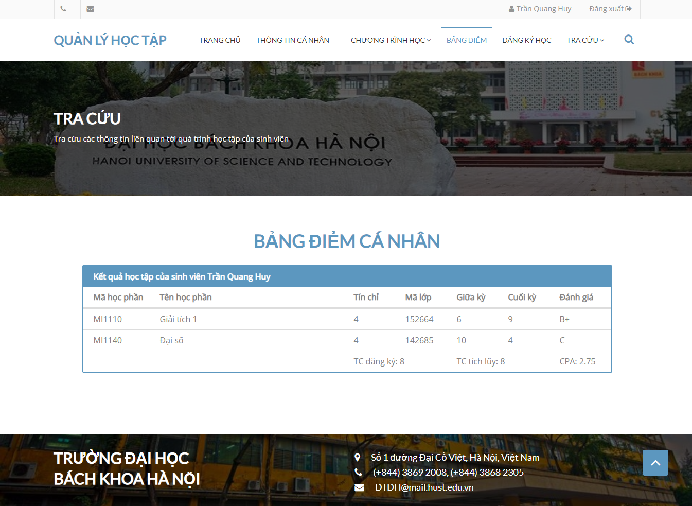

**Đăng ký học:** Khi click vào mục *Đăng ký học* trên thanh chức năng, giao diện đăng ký sẽ hiện ra. Sinh viên ghi chính xác mã lớp muốn đăng ký rồi nhấn biểu tượng thêm bản đăng ký để xác nhận với hệ thống.

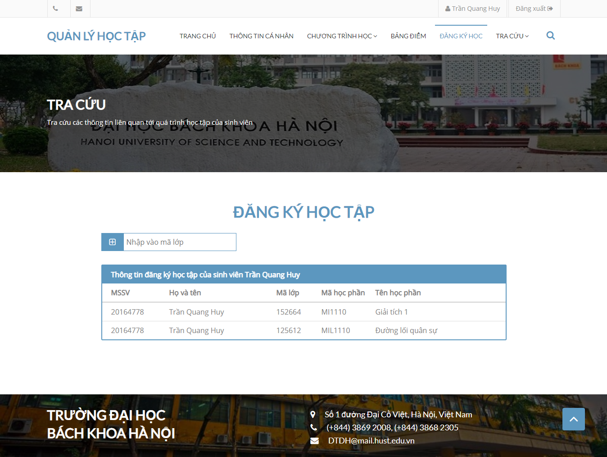

**Tra cứu học phí sinh viên:** Khi click vào mục *Học phí sinh viên* trong menu *Tra cứu* trên thanh chức năng, thông tin chi tiết về học phí của từng học phần đã đăng ký và học phí tổng cộng sẽ được hiển thị.

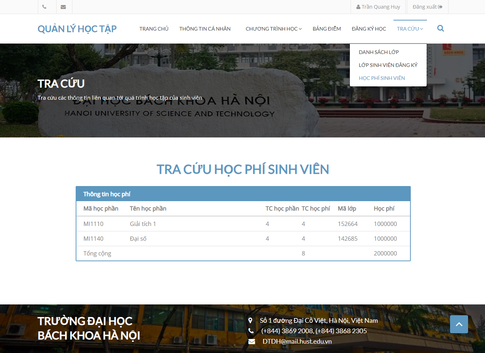

## Đối với giảng viên

Giảng viên cần đăng nhập vào hệ thống để thực hiện các chức năng trong quyền hạn của mình. Một số chức năng dành cho giảng viên được mô tả như sau:

**Các tác vụ chung:** Giảng viên có quyền thực hiện mọi tác vụ chung mà khách thăm có thể thực hiện.

**Xem và cập nhật thông tin cá nhân:** Được thực hiện như đối với sinh viên.

**Xem danh sách lớp mình giảng dạy:** Giảng viên nhấn vào mục *Bảng điểm SV* trên thanh chức năng, thông tin các lớp mình giảng dạy sẽ được hiển thị như hình dưới đây. Trong đó, bảng phía bên phải hiện thị thông tin chi tiết về các lớp đang giảng dạy, các thẻ phía bên trái giúp đi tới bảng điểm của lớp tương ứng.

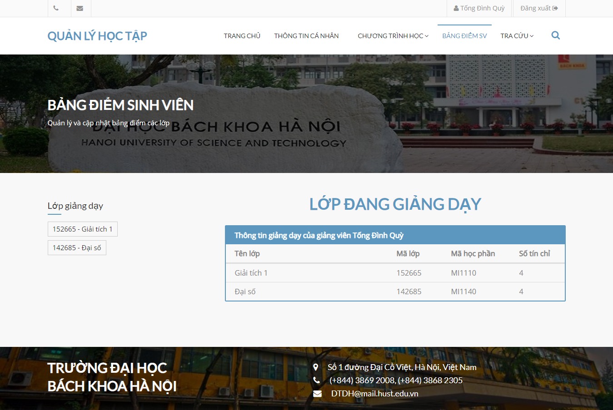

Giảng viên muốn cho/sửa điểm lớp nào, click vào thẻ tương ứng phía bên trái bảng trong giao diện trên, hệ thống sẽ điều hướng tới bảng điểm của lớp đó. Tại đây, giảng viên tìm sinh viên muốn cho điểm trong bảng, nhập điểm và nhấn *OK* để hoàn tất thay đổi. Hệ thống sẽ lưu lại thông tin chỉnh sửa điểm khi thành công.

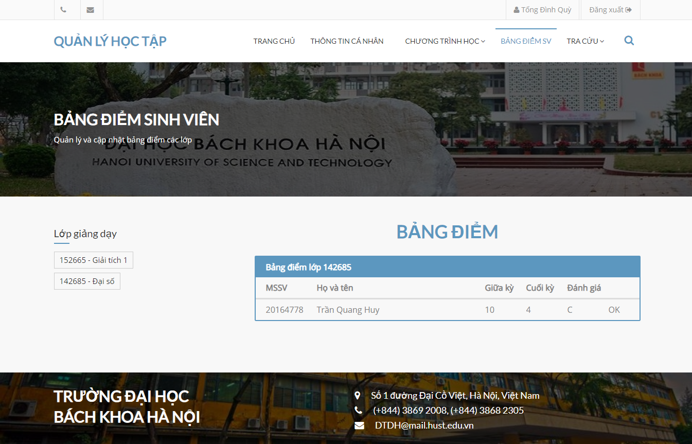

## Đối với quản trị viên

Quản trị viên cần đăng nhập vào hệ thống để thực hiện các chức năng trong quyền hạn của mình. Một số chức năng dành cho quản trị viên được mô tả như sau:

**Các tác vụ chung:** Giảng viên có quyền thực hiện mọi tác vụ chung mà khách thăm có thể thực hiện.

**Xem và cập nhật thông tin cá nhân:** Được thực hiện như đối với sinh viên.

**Tra cứu lộ trình học của sinh viên:** Khi click vào *Lộ trình học* trên thanh chức năng, cần điền mã số sinh viên cần tìm vào khung tìm kiếm, nhấn biểu tượng tìm kiếm sẽ thu được kết quả về lộ trình học của sinh viên đó.

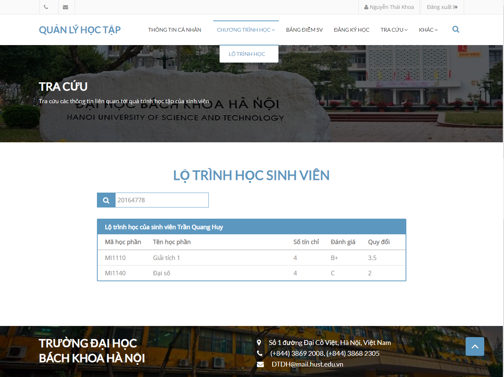

**Xem và chỉnh sửa bảng điểm sinh viên:** Khi có nhu cầu chỉnh sửa điểm số sinh viên (ví dụ khi có kết quả phúc tra), quản trị viên nhấn vào *Bảng điểm SV* trên thanh chức năng, sau đó nhập mã số sinh viên cần sửa điểm vào thanh *Tìm kiếm* phía bên trái màn hình và click biểu tượng tìm kiếm. Khi bảng điểm của sinh viên đó hiện ra, quản trị viên có thể sửa điểm số tương ứng và nhấn *OK* để hoàn tất thay đổi. Hệ thống sẽ lưu lại thông tin chỉnh sửa điểm khi thành công. Ở đây, quản trị viên chỉ có quyền sửa điểm chứ không có quyền cho điểm.

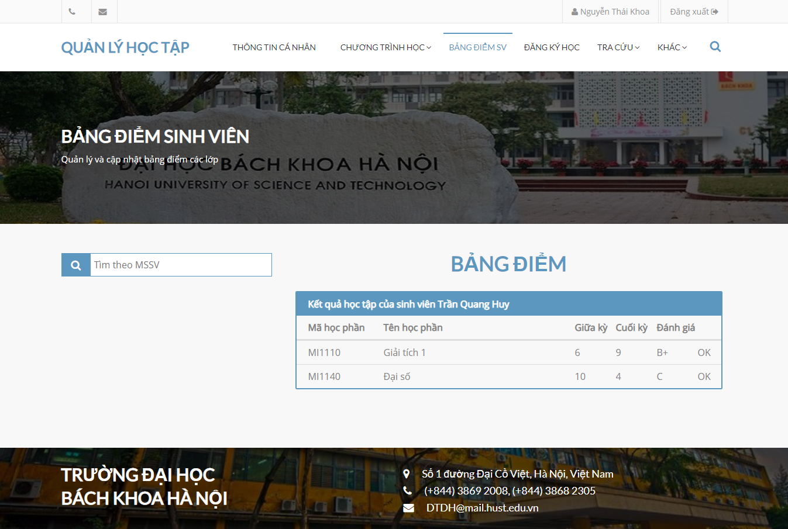

**Đăng ký học (hoặc hủy đăng ký học) cho sinh viên:** Khi click vào *Đăng ký học* trên thanh chức năng, cần điền cả mã số sinh viên và mã lớp đăng ký, sau đó nhấn biểu tượng thêm bản đăng ký để xác nhận. Thông tin lớp đã đăng ký hiển thị ngay phía dưới khung nhập liệu đó. Nếu có sự cố cần hủy đăng ký (ví dụ khi đăng ký nhầm lớp), chỉ có quản trị viên mới có quyền hủy, bằng cách click vào biểu tượng hủy bớt bản đăng ký trên dòng tương ứng.

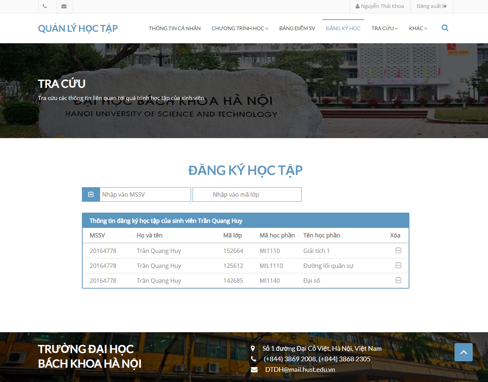

**Tra cứu học phí sinh viên:** Khi click vào *Học phí sinh viên* như vậy, cần điền mã số sinh viên cần tìm vào khung tìm kiếm, nhấn biểu tượng tìm kiếm sẽ thu được kết quả về học phí của sinh viên đó.

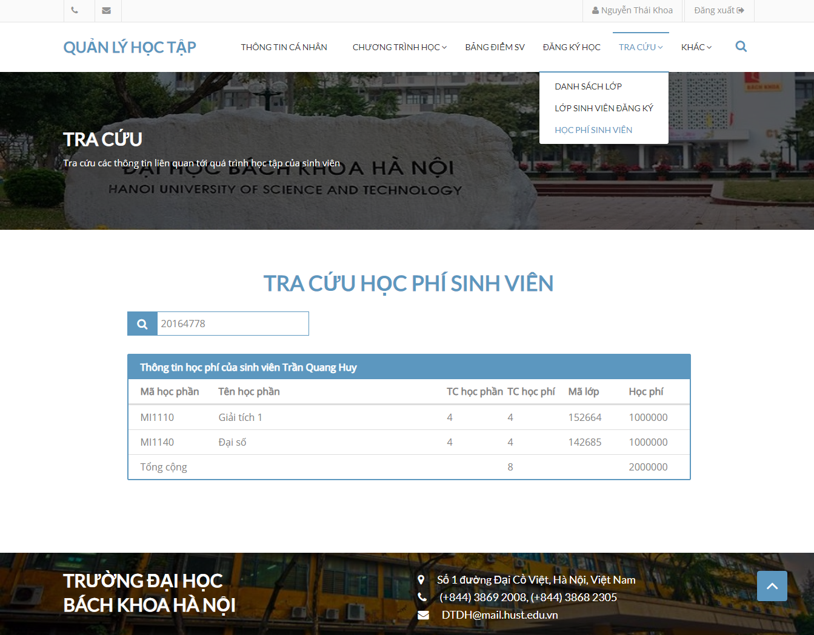

**Quản lý danh sách sinh viên toàn trường:** Khi nhấn vào *Danh sách sinh viên* trong menu *Khác* trên thanh chức năng, danh sách mọi sinh viên đang học tập tại trường sẽ được hiển thị như sau:

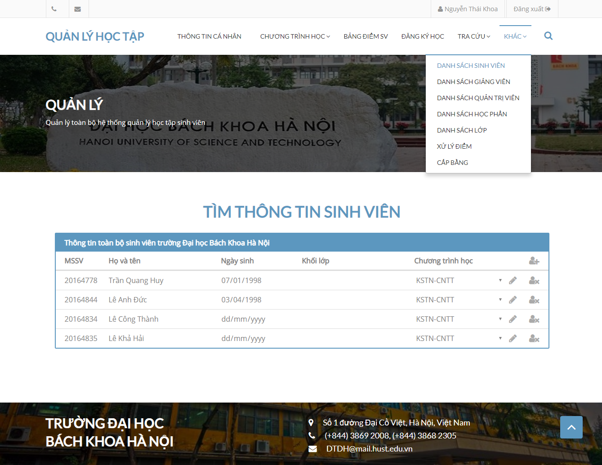

Tại đây, quản trị viên có thể thực hiện các tác vụ sau:
* Thêm sinh viên: Nhấn vào biểu tượng thêm sinh viên trong bảng, một cửa sổ pop-up sẽ hiện ra. Quản trị viên điền tên sinh viên, nhập mã số sinh viên, chọn chương trình học của sinh viên đó, ấn nút *Thêm* để hoàn thành. Hệ thống sẽ lưu lại thông tin khi thêm thành công. Khi một sinh viên mới được thêm vào danh sách, tài khoản trên hệ thống của sinh viên đó cũng ngay lập tức được tạo, với tên đăng nhập và mật khẩu mặc định chính là mã số sinh viên.
* Sửa thông tin sinh viên: Quản trị viên chỉ có quyền chỉnh sửa tên, ngày sinh, khối lớp và chương trình học của sinh viên. Tác vụ này được thực hiện ngay trên bảng thông tin sinh viên, bằng cách click vào tên/ngày sinh/khối lớp/chương trình học cần sửa, điền (đối với tên/ngày sinh/khối lớp) hoặc chọn mục thích hợp (đối với ngày sinh/chương trình học). Sau đó, nhấn vào biểu tượng *Sửa* (có hình chiếc bút) trên hàng tương ứng của bảng để xác nhận quá trình chỉnh sửa. Hệ thống sẽ lưu lại thông tin chỉnh sửa khi thành công.
* Xóa sinh viên khỏi danh sách: Quản trị viên tìm sinh viên cần xóa trong bảng, sau đó click vào biểu tượng xóa trên dòng tương ứng. Một cửa sổ pop-up hiện lên, yêu cầu xác nhận thao tác. Nếu xác nhận thực sự muốn xóa, mọi thông tin liên quan tới sinh viên sẽ bị xóa hoàn toàn khỏi hệ thống và không thể khôi phục, ngược lại thao tác xóa sẽ bị hủy.

**Quản lý danh sách giảng viên:** Khi nhấn vào *Danh sách giảng viên* trong menu *Khác* trên thanh chức năng, danh sách mọi giảng viên đang giảng dạy tại trường sẽ được hiển thị như sau:

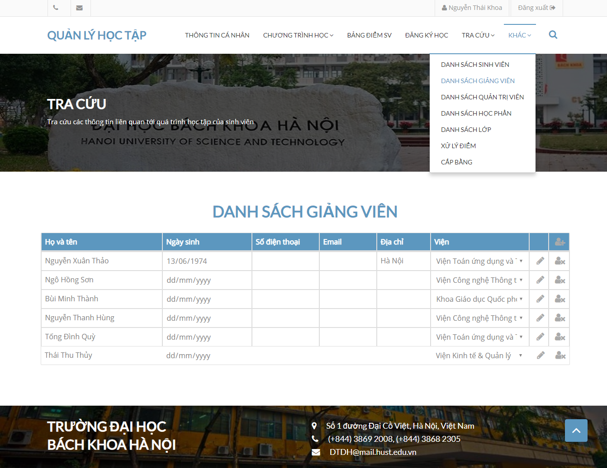

Tại đây, quản trị viên có thể thực hiện các tác vụ sau:
* Thêm giảng viên: Nhấn vào biểu tượng thêm giảng viên trong bảng, một cửa sổ pop-up sẽ hiện ra. Quản trị viên điền tên giảng viên, nhập mã giảng viên, chọn Khoa/Viện của giảng viên đó, ấn nút *Thêm* để hoàn thành. Hệ thống sẽ lưu lại thông tin khi thêm thành công. Khi một giảng viên mới được thêm vào danh sách, tài khoản trên hệ thống của giảng viên đó cũng ngay lập tức được tạo, với tên đăng nhập và mật khẩu mặc định chính là mã giảng viên.
* Sửa thông tin giảng viên: Quản trị viên chỉ có quyền chỉnh sửa tên, ngày sinh, Khoa/Viện của giảng viên. Tác vụ này được thực hiện ngay trên bảng thông tin giảng viên, bằng cách click vào tên, ngày sinh, Khoa/Viện cần sửa, điền (đối với tên/ngày sinh) hoặc chọn mục thích hợp (đối với ngày sinh/Khoa/Viện). Sau đó, nhấn vào biểu tượng *Sửa* (có hình chiếc bút) trên hàng tương ứng của bảng để xác nhận quá trình chỉnh sửa. Hệ thống sẽ lưu lại thông tin chỉnh sửa khi thành công.
* Xóa giảng viên khỏi danh sách: Quản trị viên tìm giảng viên cần xóa trong bảng, sau đó click vào biểu tượng xóa trên dòng tương ứng. Một cửa sổ pop-up hiện lên, yêu cầu xác nhận thao tác. Nếu xác nhận thực sự muốn xóa, mọi thông tin liên quan tới giảng viên sẽ bị xóa hoàn toàn khỏi hệ thống và không thể khôi phục, ngược lại thao tác xóa sẽ bị hủy.

**Quản lý danh sách quản trị viên:** Khi nhấn vào *Danh sách quản trị viên* trong menu *Khác* trên thanh chức năng, danh sách mọi quản trị đang làm việc tại trường sẽ được hiển thị như sau:

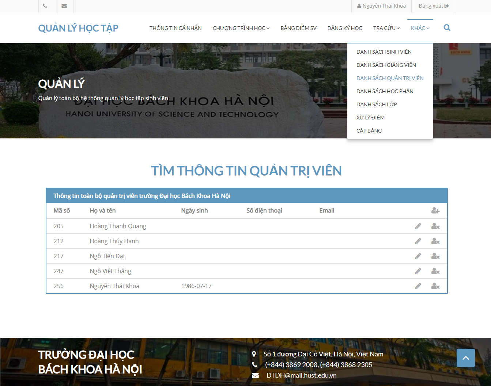

Tại đây, quản trị viên có thể thực hiện các tác vụ sau:
* Thêm quản trị viên: Nhấn vào biểu tượng thêm quản trị viên trong bảng, một cửa sổ pop-up sẽ hiện ra. Quản trị viên điền tên và nhập mã quản trị viên, ấn nút *Thêm* để hoàn thành. Hệ thống sẽ lưu lại thông tin khi thêm thành công. Khi một quản trị viên mới được thêm vào danh sách, tài khoản trên hệ thống của quản trị viên đó cũng ngay lập tức được tạo, với tên đăng nhập và mật khẩu mặc định chính là mã số nhân viên.
* Sửa thông tin quản trị viên: Quản trị viên chỉ có quyền chỉnh sửa tên của quản trị viên khác. Tác vụ này được thực hiện ngay trên bảng thông tin quản trị viên, bằng cách click vào tên cần sửa, điền tên mới. Sau đó, nhấn vào biểu tượng *Sửa* (có hình chiếc bút) trên hàng tương ứng của bảng để xác nhận quá trình chỉnh sửa. Hệ thống sẽ lưu lại thông tin chỉnh sửa khi thành công.
* Xóa quản trị viên khỏi danh sách: Quản trị viên tìm quản trị viên cần xóa trong bảng, sau đó click vào biểu tượng xóa trên dòng tương ứng. Một cửa sổ pop-up hiện lên, yêu cầu xác nhận thao tác. Nếu xác nhận thực sự muốn xóa, mọi thông tin liên quan tới quản trị viên đó sẽ bị xóa hoàn toàn khỏi hệ thống và không thể khôi phục, ngược lại thao tác xóa sẽ bị hủy.

**Quản lý danh sách học phần:** Khi nhấn vào *Danh sách học phần* trong menu *Khác* trên thanh chức năng, danh sách mọi học phần hiện có sẽ được hiển thị như sau:

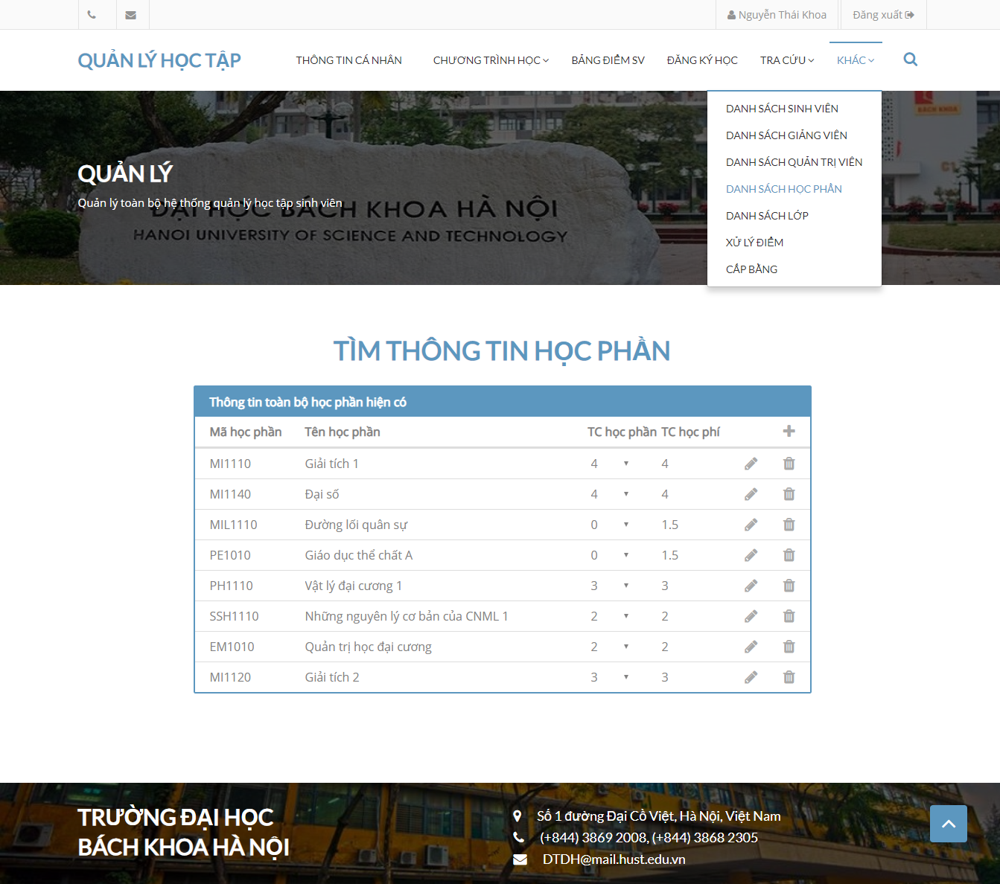

Tại đây, quản trị viên có thể thực hiện các tác vụ sau:
* Thêm học phần: Nhấn vào biểu tượng thêm học phần (có hình dấu cộng) trong bảng, một cửa sổ pop-up sẽ hiện ra. Quản trị viên điền tên học phần, nhập mã học phần và chọn số tín chỉ, ấn nút *Thêm* để hoàn thành. Hệ thống sẽ lưu lại thông tin khi thêm thành công.
* Sửa thông tin học phần: Quản trị viên chỉ có quyền chỉnh sửa tên và số tín chỉ của học phần đó. Tác vụ này được thực hiện ngay trên bảng thông tin học phần, bằng cách click vào tên học phần hoặc số tín chỉ, điền (đối với tên) hoặc chọn (đối với số tín chỉ). Sau đó, nhấn vào biểu tượng *Sửa* (có hình chiếc bút) trên hàng tương ứng của bảng để xác nhận quá trình chỉnh sửa. Hệ thống sẽ lưu lại thông tin chỉnh sửa khi thành công.
* Xóa học phần khỏi danh sách: Quản trị viên tìm học phần cần xóa trong bảng, sau đó click vào biểu tượng xóa trên dòng tương ứng. Một cửa sổ pop-up hiện lên, yêu cầu xác nhận thao tác. Nếu xác nhận thực sự muốn xóa, mọi thông tin liên quan tới học phần đó sẽ bị xóa hoàn toàn khỏi hệ thống và không thể khôi phục, ngược lại thao tác xóa sẽ bị hủy.

**Quản lý danh sách học phần:** Khi nhấn vào *Danh sách lớp* trong menu *Khác* trên thanh chức năng, danh sách mọi lớp học hiện có sẽ được hiển thị như sau:

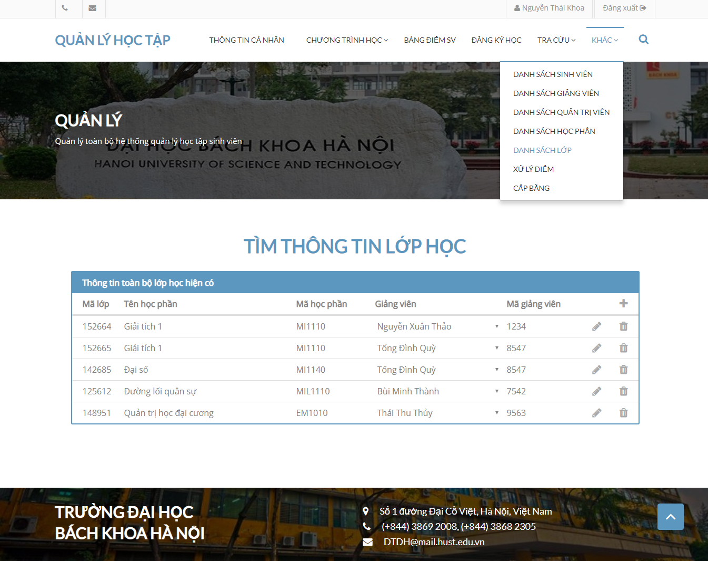

Tại đây, quản trị viên có thể thực hiện các tác vụ sau:
* Thêm lớp mới: Nhấn vào biểu tượng thêm lớp mới (có hình dấu cộng) trong bảng, một cửa sổ pop-up sẽ hiện ra. Quản trị viên điền mã lớp, chọn học phần và chọn giảng viên giảng dạy cho lớp đó, ấn nút *Thêm* để hoàn thành. Hệ thống sẽ lưu lại thông tin khi thêm thành công.
* Sửa thông tin lớp: Quản trị viên chỉ có quyền thay đổi giảng viên giảng dạy cho lớp đó. Tác vụ này được thực hiện ngay trên bảng thông tin lớp, bằng cách click vào tên giảng viên giảng dạy và chọn giảng viên mới. Sau đó, nhấn vào biểu tượng *Sửa* (có hình chiếc bút) trên hàng tương ứng của bảng để xác nhận quá trình chỉnh sửa. Hệ thống sẽ lưu lại thông tin chỉnh sửa khi thành công.
* Xóa lớp học khỏi danh sách: Quản trị viên tìm lớp cần xóa trong bảng, sau đó click vào biểu tượng xóa trên dòng tương ứng. Một cửa sổ pop-up hiện lên, yêu cầu xác nhận thao tác. Nếu xác nhận thực sự muốn xóa, mọi thông tin liên quan tới lớp đó sẽ bị xóa hoàn toàn khỏi hệ thống và không thể khôi phục, ngược lại thao tác xóa sẽ bị hủy.

**Xử lý điểm:** Click vào mục *Xử lý điểm* trong menu *Khác* trên thanh chức năng. Hệ thống sẽ tự động thực hiện xử lý (tính CPA, số tín chỉ đăng ký và số tín chỉ tích lũy của mọi sinh viên trong trường), sau đó sẽ chuyển về trang chủ. Thao tác xử lý của hệ thống không thể hiện trên giao diện đối với quản trị viên.

**Cấp bằng:** Click vào mục *Cấp bằng* trong menu *Khác* trên thanh chức năng. Một bảng sẽ hiện ra như dưới đây, bao gồm thông tin về mọi sinh viên đã đủ điều kiện cấp bằng. Để xem thông tin chi tiết về quá trình học tập của một sinh viên, quản trị viên có thể click vào biểu tượng bảng điểm trên dòng tương ứng.

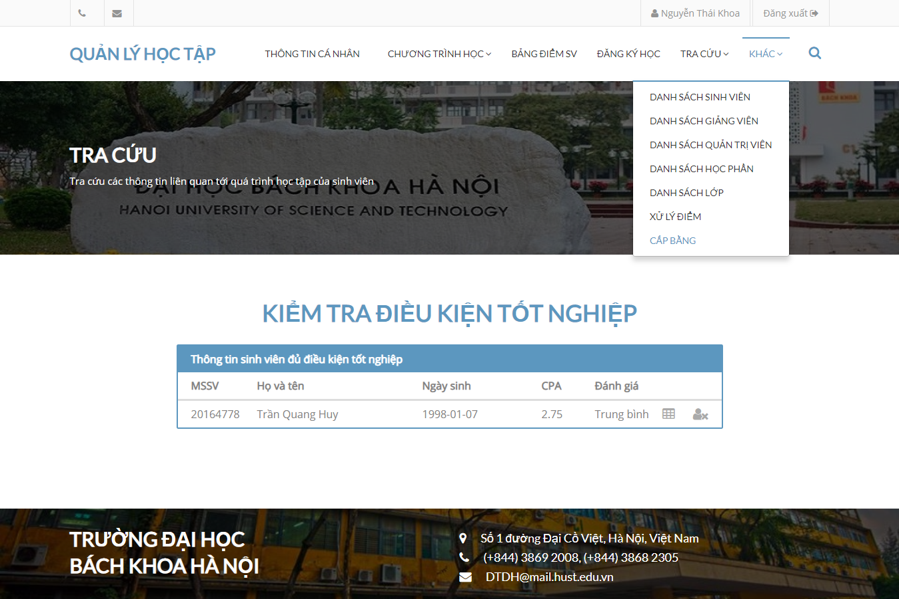